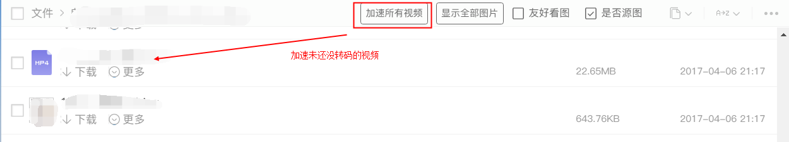

# 使用说明
这个仓库放的都是一些我写的油猴脚本，下面就对一些插件的使用做一下说明
#### 115img.user.js
115其实是一个很好的图床，里面可以存放很多图片，但是115做了一些限制，打开文件夹默认显示的是一张张缩略图，点击打开之后显示一张大图，一张张查看大图，实在太慢。所以写了这个脚本，一次性可以打开所有的图片的地址显示。

安装完成之后，点击**查看全部图片**即可

点击之后弹窗显示

其中的友好看图选项控制弹窗是否充满屏幕显示，是否源图的话就是控制打开的是压缩的还是原图。
#### 20170408更新功能
